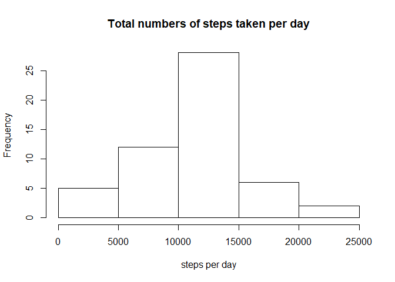
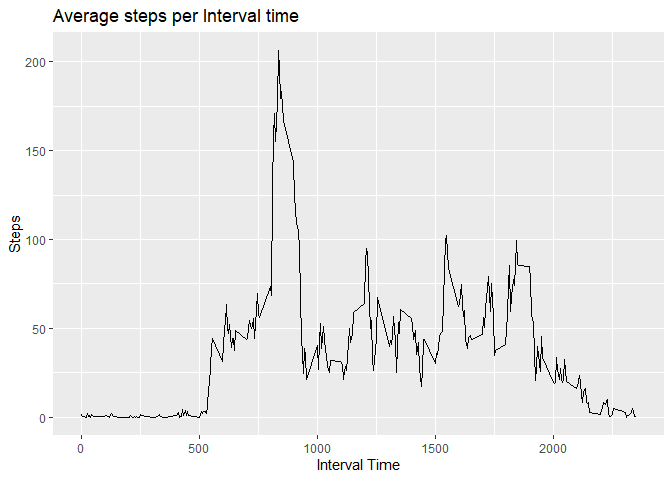
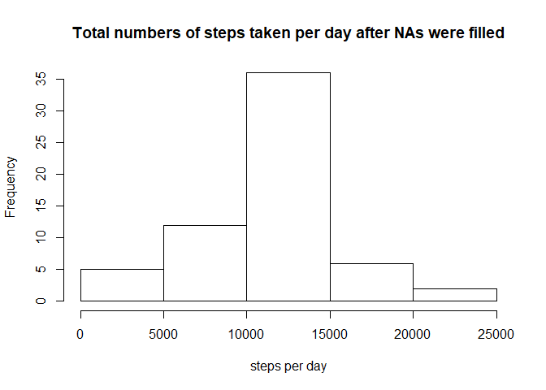
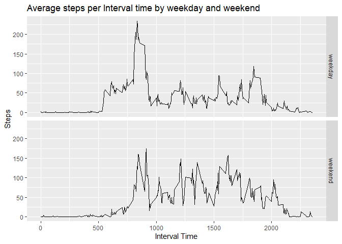

#This is a report that answers the questions detailed below. 
1. What is mean total number of steps taken per day?
2. What is the average daily activity pattern?
3. Imputing missing values
4. Are there differences in activity patterns between weekdays and weekends?

#load data

```r
setwd("C:/Users/Qingliang/Desktop/Rproj/course 5 Repro")
ori_data <- read.csv("activity.csv")
```

#caculate total steps per day and plot, for this part of the assignment, ignore the missing values in the dataset

```r
total_steps_day <- aggregate(ori_data$steps, 
                             by = list(day = ori_data$date), 
                             FUN =sum)
hist(total_steps_day$x, breaks = 5, xlab = "steps per day",
		 main = "Total numbers of steps taken per day")
```

<!-- -->

#summary the total steps per day

```r
names(total_steps_day) <- c("day", "steps")
summ1 <- summary(total_steps_day)
summ1 
```

```
##          day         steps      
##  2012-10-01: 1   Min.   :   41  
##  2012-10-02: 1   1st Qu.: 8841  
##  2012-10-03: 1   Median :10765  
##  2012-10-04: 1   Mean   :10766  
##  2012-10-05: 1   3rd Qu.:13294  
##  2012-10-06: 1   Max.   :21194  
##  (Other)   :55   NA's   :8
```

#caculate average steps by interval, plot

```r
stepsPerInter <- aggregate(steps ~ interval, data = ori_data, 
                           FUN = mean, 
				                   na.action = na.omit)
	library(ggplot2)
	ggplot(stepsPerInter, aes(interval, steps))+
	geom_line()+
	ggtitle("Average steps per Interval time")+
	xlab("Interval Time")+
	ylab("Steps")
```

<!-- -->

#select which 5 minite interval contains max numbers of steps

```r
maxsteps <- stepsPerInter[which.max(stepsPerInter$steps),]
maxsteps
```

```
##     interval    steps
## 104      835 206.1698
```

#Calculate and report the total number of missing values

```r
sum(is.na(ori_data))
```

```
## [1] 2304
```

#fill NA with average steps at that interval

```r
fill_data <- merge(ori_data, stepsPerInter, by = "interval")
fill_data <- transform(fill_data, filled = ifelse(is.na(steps.x),
					             as.character(steps.y), steps.x))
fill_data <- fill_data[, c("interval", "date", "filled")]
names(fill_data) <- c("interval", "date", "steps")
fill_data$steps <- as.numeric(as.character(fill_data$steps))
```

#Make a histogram of the total number of steps taken each day for the filled data

```r
total_steps_day <- aggregate(fill_data$steps, 
                             by = list(day = fill_data$date), 
					                   FUN = sum)
hist(total_steps_day$x, breaks = 5, xlab = "steps per day",
		 main = "Total numbers of steps taken per day after NAs were filled")
```

<!-- -->

#Calculate and report the mean and median total number of steps taken per day for the filled data

```r
summ2 <- summary(total_steps_day)
```

#compare summ1 for original data and summ2 for NA filled data

```r
ori_data_summ <- summ1[, 2]
filled_data_summ <- summ2[, 2]
data.frame(ori_data_summ, filled_data_summ)
```

```
##     ori_data_summ filled_data_summ
## 1 Min.   :   41    Min.   :   41  
## 2 1st Qu.: 8841    1st Qu.: 9819  
## 3 Median :10765    Median :10766  
## 4 Mean   :10766    Mean   :10766  
## 5 3rd Qu.:13294    3rd Qu.:12811  
## 6 Max.   :21194    Max.   :21194  
## 7     NA's   :8               <NA>
```

#Create a new factor variable in the dataset with two levels weekday and weekend, indicating whether a given date is a weekday or weekend day

```r
ori_data$DateType <- as.Date(ori_data$date)
ori_data$weekdays <- weekdays(ori_data$DateType)
ori_data$DayType <- ifelse(ori_data$weekdays == "Saturday" | ori_data$weekdays == "Sunday", "weekend", "weekday")
```

#caculate average steps by interval and DayTye, plot

```r
stepsPerInter2 <- aggregate(steps ~ interval + DayType, 
                            data = ori_data, FUN = mean, 
				                    na.action = na.omit)
  ggplot(stepsPerInter2, aes(interval, steps))+
	geom_line()+
  facet_grid(DayType ~ .)+
	ggtitle("Average steps per Interval time by weekday and weekend")+
	xlab("Interval Time")+
	ylab("Steps")
```

<!-- -->


